# HomeLog — Diagramma Entità-Relazione

> Notazione crow's foot (Mermaid). Renderizzato nativamente su GitHub.

```mermaid
erDiagram
    USER {
        uint id PK
        string email UK
        string password_hash
        string name
        string role "admin | user"
        bool is_active
        string avatar_path
        string password_reset_token
        datetime password_reset_expires
    }

    USER_SETTINGS {
        uint id PK
        uint user_id FK, UK
        string language
        string currency
        string theme "auto | light | dark"
        string date_format
        uint default_property_id FK
        string default_split_member_ids "JSON"
        string default_templates "JSON"
        bool email_notifications
        bool in_app_notifications
        int bill_due_alert_days
        int reading_reminder_days
        int notification_retention_days
        float anomaly_threshold
    }

    PROPERTY {
        uint id PK
        uint user_id FK
        string name
        string address
        string type "owned | rented"
        datetime start_date
        datetime end_date
        bool is_current
        int residents
    }

    HOUSEHOLD_MEMBER {
        uint id PK
        uint property_id FK
        uint user_id FK "nullable"
        string name
        string role
        bool is_virtual
    }

    HOUSEHOLD_SETTINGS {
        uint id PK
        uint property_id FK, UK
        bool split_mode
        string default_split_type "equal | custom | income_based"
    }

    CATEGORY {
        uint id PK
        uint user_id FK "nullable - system default"
        string name
        string icon
        string color
        bool is_default
    }

    SUBCATEGORY {
        uint id PK
        uint category_id FK
        string name
    }

    EXPENSE {
        uint id PK
        uint user_id FK
        uint property_id FK "nullable"
        uint category_id FK
        uint subcategory_id FK "nullable"
        uint project_id FK "nullable"
        uint bill_id FK "nullable"
        uint paid_by_member_id FK
        float amount
        datetime date
        string description
        string attachment_url
        bool is_split
    }

    EXPENSE_SPLIT {
        uint id PK
        uint expense_id FK
        uint member_id FK
        uint settlement_id FK "nullable"
        float amount
        bool is_settled
        datetime settled_at
    }

    SETTLEMENT {
        uint id PK
        uint property_id FK
        uint from_member_id FK
        uint to_member_id FK
        float amount
        datetime date
        string payment_method "cash | bank | satispay | paypal"
        string note
    }

    PROJECT {
        uint id PK
        uint user_id FK
        uint property_id FK "nullable"
        string name
        string icon
        float budget
        datetime start_date
        datetime end_date
        string description
        string status "active | completed | cancelled"
    }

    UTILITY {
        uint id PK
        uint user_id FK
        uint property_id FK
        uint default_category_id FK "nullable"
        uint paid_by_member_id FK "nullable"
        uint default_bill_template_id FK "nullable"
        string type "electricity | gas | water | waste | internet | ..."
        string provider
        string customer_code
        string service_code "POD | PDR | contratto"
        string address
        datetime start_date
        datetime end_date
        bool is_active
        bool is_metered
        float power_capacity "solo elettricita"
        bool allows_self_reading
        float comparison_threshold
        float threshold_per_day
        float recurring_amount "solo canone fisso"
        int billing_interval
        string billing_unit "day | week | month | year"
        bool auto_create_expense
        bool auto_mark_paid
        string customer_portal
        string notes
    }

    METER_READING {
        uint id PK
        uint utility_id FK
        datetime reading_date
        float value "gas | water"
        float value_f1 "elettricita F1"
        float value_f2 "elettricita F2"
        float value_f3 "elettricita F3"
        string source "manual | submitted"
        string photo_url
        string notes
    }

    BILL {
        uint id PK
        uint utility_id FK
        uint user_reading_id FK "nullable"
        string bill_number UK
        datetime issue_date
        datetime period_start
        datetime period_end
        datetime due_date
        datetime provider_reading_date
        float provider_reading_f1
        float provider_reading_f2
        float provider_reading_f3
        float provider_reading
        string reading_type "actual | estimated"
        float consumption_total
        float consumption_f1
        float consumption_f2
        float consumption_f3
        float conversion_coefficient
        float estimated_reading
        float estimated_consumption
        float amount_total
        float amount_energy
        float amount_fixed
        float amount_taxes
        float amount_vat
        bool is_paid
        datetime paid_date
        string pdf_url
        string parsed_data "JSON"
    }

    UTILITY_RATE {
        uint id PK
        uint utility_id FK
        datetime effective_date
        float rate_f1
        float rate_f2
        float rate_f3
        float rate_fixed
        float rate_unit
        string notes
    }

    PRICE_CHANGE {
        uint id PK
        uint utility_id FK
        uint source_bill_id FK "nullable"
        datetime effective_date
        float old_amount
        float new_amount
        string reason
        datetime cancellation_deadline
    }

    SERVICE_COMMUNICATION {
        uint id PK
        uint utility_id FK
        uint bill_id FK "nullable"
        string type "price_change | contract | info | privacy"
        string title
        text content
        datetime action_deadline
        bool is_important
        bool is_read
    }

    BILL_TEMPLATE {
        uint id PK
        uint user_id FK
        string name
        string provider
        string utility_type
        bool is_default
        text extraction_rules "JSON"
    }

    CONTRACT_TEMPLATE {
        uint id PK
        uint user_id FK
        string name
        string provider
        string utility_type
        bool is_default
        text extraction_rules "JSON"
    }

    %% ══════════════════════════════════════
    %% RELAZIONI
    %% ══════════════════════════════════════

    %% --- Utenti e Proprietà ---
    USER ||--|| USER_SETTINGS : "ha"
    USER ||--o{ PROPERTY : "possiede"
    PROPERTY ||--o{ HOUSEHOLD_MEMBER : "include"
    USER |o--o{ HOUSEHOLD_MEMBER : "e (opzionale)"
    PROPERTY ||--o| HOUSEHOLD_SETTINGS : "configura"

    %% --- Categorie ---
    USER |o--o{ CATEGORY : "definisce"
    CATEGORY ||--o{ SUBCATEGORY : "ha"

    %% --- Spese ---
    USER ||--o{ EXPENSE : "registra"
    CATEGORY ||--o{ EXPENSE : "classifica"
    SUBCATEGORY |o--o{ EXPENSE : "sottoclassifica"
    PROPERTY |o--o{ EXPENSE : "in"
    HOUSEHOLD_MEMBER ||--o{ EXPENSE : "pagata da"

    %% --- Suddivisione e Saldi ---
    EXPENSE ||--o{ EXPENSE_SPLIT : "suddivisa in"
    HOUSEHOLD_MEMBER ||--o{ EXPENSE_SPLIT : "quota di"
    SETTLEMENT |o--o{ EXPENSE_SPLIT : "salda"
    PROPERTY ||--o{ SETTLEMENT : "in"
    HOUSEHOLD_MEMBER ||--o{ SETTLEMENT : "da (debitore)"
    HOUSEHOLD_MEMBER ||--o{ SETTLEMENT : "a (creditore)"

    %% --- Progetti ---
    USER ||--o{ PROJECT : "crea"
    PROPERTY |o--o{ PROJECT : "in"
    PROJECT |o--o{ EXPENSE : "in progetto"
    PROJECT }o--o{ USER : "condiviso con"

    %% --- Utenze ---
    USER ||--o{ UTILITY : "gestisce"
    PROPERTY ||--o{ UTILITY : "servita da"
    UTILITY ||--o{ METER_READING : "rileva"
    UTILITY ||--o{ BILL : "fattura"
    UTILITY ||--o{ UTILITY_RATE : "tariffa"
    UTILITY ||--o{ PRICE_CHANGE : "variazione prezzo"
    UTILITY ||--o{ SERVICE_COMMUNICATION : "comunica"
    UTILITY |o--o| BILL_TEMPLATE : "usa template"
    UTILITY |o--o| CATEGORY : "categoria default"
    UTILITY |o--o| HOUSEHOLD_MEMBER : "pagata da (default)"

    %% --- Bollette ---
    BILL |o--o| METER_READING : "associata a lettura"
    BILL |o--o{ EXPENSE : "genera spesa"
    BILL |o--o{ PRICE_CHANGE : "annuncia in"
    BILL |o--o{ SERVICE_COMMUNICATION : "estratta da"

    %% --- Template ---
    USER ||--o{ BILL_TEMPLATE : "crea"
    USER ||--o{ CONTRACT_TEMPLATE : "crea"
```

## Legenda cardinalità (crow's foot)

| Simbolo | Significato |
|---------|-------------|
| `\|\|` | Esattamente uno (1,1) |
| `\|o` | Zero o uno (0,1) |
| `}o` | Zero o molti (0,N) |
| `}\|` | Uno o molti (1,N) |

## Note

- **Generalizzazione UTILITY**: `is_metered = true` → servizio a contatore (electricity, gas, water) con campi `power_capacity`, `allows_self_reading`, `comparison_threshold`; `is_metered = false` → servizio a canone fisso (waste, internet, insurance, affitto, mutuo) con campi `recurring_amount`, `billing_interval`, `billing_unit`. La classificazione per tipo vive in `models.MeteredByType` — waste (TARI) è a canone perché fatturata sulla superficie, non sui consumi
- **Entità deboli**: `SUBCATEGORY`, `EXPENSE_SPLIT`, `METER_READING`, `BILL`, `UTILITY_RATE`, `PRICE_CHANGE`, `SERVICE_COMMUNICATION` dipendono dall'entità padre per l'identificazione
- **Many-to-many**: `PROJECT ↔ USER` tramite tabella ponte `project_members`
- **Campi audit** (`created_at`, `updated_at`, `deleted_at`) omessi per leggibilità
- **Soft delete** (GORM `DeletedAt`): User, Property, Expense, Utility, Bill, Settlement, ContractTemplate, ServiceCommunication
